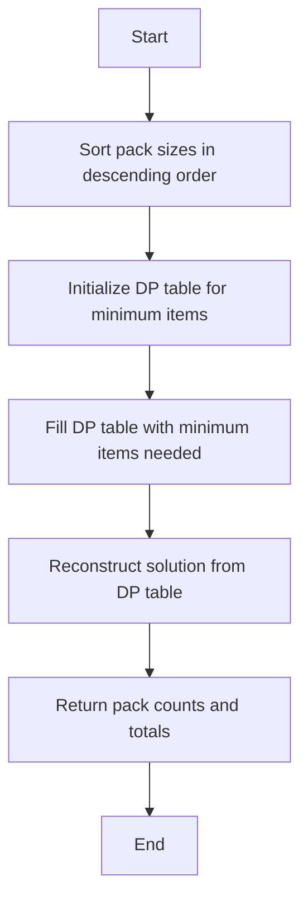
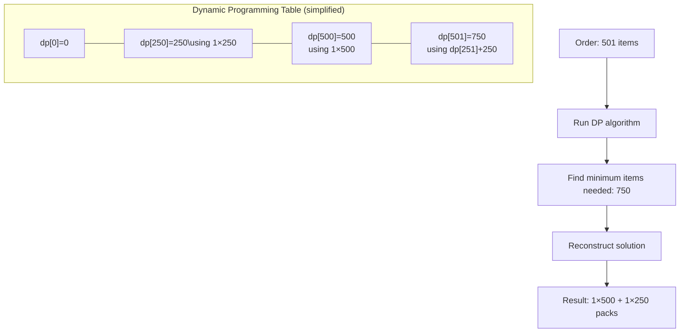
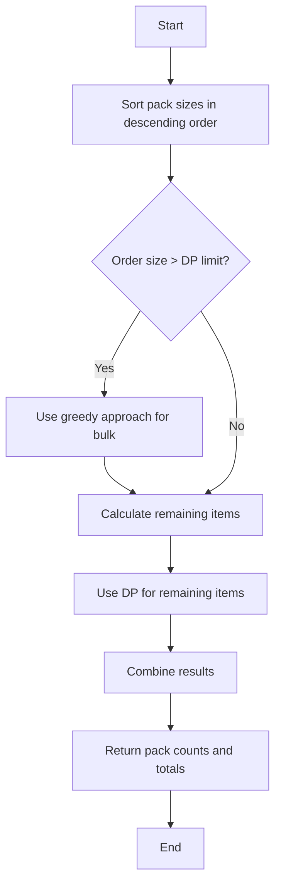
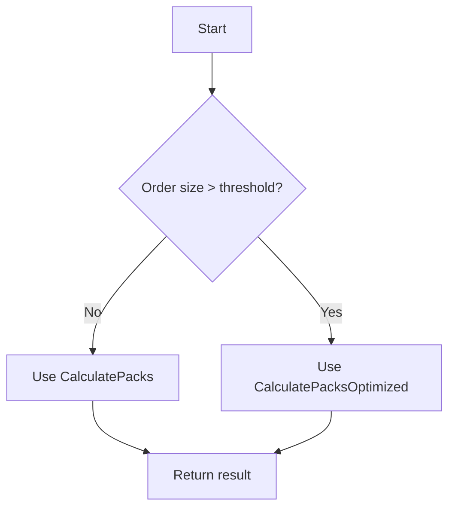

# Pack Optimization Algorithm Visualization

> **Note:** This package provides two implementations of the pack optimization algorithm:
> 1. `CalculatePacks`: The original pure dynamic programming approach (described below)
> 2. `CalculatePacksOptimized`: An optimized hybrid approach for larger orders
>
> For performance comparison, see [benchmark_results.md](benchmark_results.md)

## Algorithm Flow



## Dynamic Programming Approach

1. **Initialize DP Table**:
    - `dp[i]` = minimum number of items needed to fulfill an order of size `i`
    - Initially all values set to maximum except `dp[0] = 0`

2. **Fill DP Table**:

```mermaid
flowchart LR
    DP0[dp\[0\]=0] --> DP1[dp\[1\]]
    DP1 --> DP2[dp\[2\]]
    DP2 --> DP3[...]
    DP3 --> DPN[dp\[n\]]
    PS1[Pack: 250] -.-> DP1
    PS2[Pack: 500] -.-> DP2
    PS3[Pack: 1000] -.-> DP3
```

3. **Transition Logic**:
    - For each target `i` and each pack size `size`:
        - If `i ≥ size`: Try using this pack with the best solution for `i-size`
        - If `i < size`: Potentially use this pack directly if it's better than current solution

## Example: Order of 501 items

### Step 1: Fill DP Table
*Pack sizes: 5000, 2000, 1000, 500, 250*

| Target | Minimum Items | Pack Used |
|--------|---------------|-----------|
| ... | ... | ... |
| 250 | 250 | 250 |
| ... | ... | ... |
| 500 | 500 | 500 |
| 501 | 750 | 250 |
| ... | ... | ... |

### Step 2: Reconstruct Solution
Starting at target=501:
1. See that `packUsed[501] = 250`
2. Add one 250-pack to solution
3. Reduce target by 250: 501-250 = 251
4. See that `packUsed[251] = 500`
5. Add one 500-pack to solution
6. Reduce target by 500: 251-500 = -249 (done)

Final solution for 501 items:
- 1 × 500 pack
- 1 × 250 pack
- Total items: 750
- Excess items: 249

## Detailed Example Walk-through



## Key Insights

1. **Two-Level Optimization**:
    - First minimize total items shipped (Rule #2)
    - Then minimize number of packs (Rule #3)

2. **Preference for Larger Packs**:
    - When two solutions have the same total items, the one with fewer packs is chosen
    - This naturally prefers larger packs when possible

3. **Edge Cases**:
    - Orders smaller than the smallest pack size still receive the smallest pack
    - When exact fulfillment isn't possible, algorithm finds the closest solution with minimal excess

## Optimized Algorithm Approach

The `CalculatePacksOptimized` function uses a hybrid approach that combines greedy algorithm with dynamic programming:



### Key Optimizations:

1. **Limited DP Table Size**:
   - Instead of creating a DP table of size equal to the order, it limits the table to a small multiple of the smallest pack size
   - This dramatically reduces memory usage for large orders

2. **Greedy Pre-processing**:
   - For large orders, it first uses a greedy approach to handle the bulk of the order
   - Only uses DP for the remaining smaller amount

3. **Performance Characteristics**:
   - Slightly less efficient for very small orders
   - Dramatically more efficient for medium to large orders (5000+ items)
   - See [benchmark_results.md](benchmark_results.md) for detailed performance comparison

## Automatic Algorithm Selection

The package provides an `OptimalCalculatePacks` function that automatically selects the most efficient algorithm based on order size and pack sizes:



### Selection Criteria:

1. **Order Size Threshold**:
   - Default threshold: 2500 items
   - For orders ≤ 2500 items: Uses `CalculatePacks` (pure DP approach)
   - For orders > 2500 items: Uses `CalculatePacksOptimized` (hybrid approach)

2. **Pack Size Adjustment**:
   - If there are more than 5 different pack sizes available, the threshold is lowered to 1000 items
   - This is because DP becomes more expensive with more pack size options

This automatic selection ensures optimal memory usage and performance across all order sizes.
